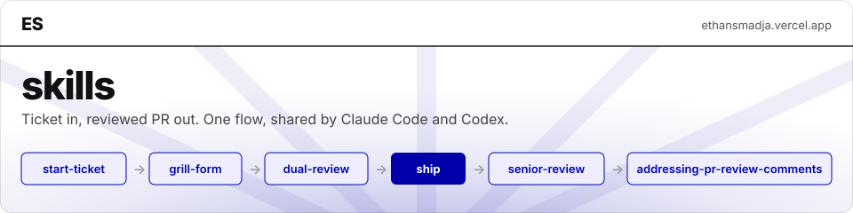

<p align="center">
  
</p>

<p align="center">
  <a href="#in-the-order-they-are-used"></a>
  </a>
  
  <a href="https://github.com/vercel-labs/skills"></a>
  <a href="https://github.com/ethansmadjaa/skills/commits/main"></a>
</p>

Agent skills I wrote for my own delivery flow. One directory per skill, `SKILL.md` at its root, shared by Claude Code and Codex.

## In the order they are used

| # | Skill | When | What it does |
| --- | --- | --- | --- |
| 1 | `start-ticket` | Task start | Reads the ticket from the issue tracker, checks it against the repo, grills the open decisions, writes the settled design back on the ticket. No git writes. |
| 2 | `grill-form` | During a grill | Turns a round of questions into an HTML form; the copied answers are the prompt that resumes the session. |
| 3 | `dual-review` | Mid-task, optional | Reviews the diff with `/code-review` and Codex in parallel, keeps the valid findings, fixes them. Stops before committing. |
| 4 | `ship` | Task end | Reviews and tests the final change, presents the exact lot for approval, commits, pushes, opens the PR, then follows CI and reviews with `scripts/pr-watch.sh` in the background. |
| 5 | `senior-review` | Called by `ship` step 3 | One isolated, evidence-based review by a fresh agent, returned as a compact verdict. |
| 6 | `addressing-pr-review-comments` | Called by `ship` follow-through | Works through PR feedback from threads, review bodies and conversation comments: verify, fix, reply, resolve. |

## Skills and tools these call that are not mine

| Referenced as | Used by | Source |
| --- | --- | --- |
| `mattpocock-skills:grilling`, `wayfinder` | `start-ticket`, `grill-form` | https://github.com/mattpocock/skills |
| `codex:codex-rescue`, `codex:setup` | `dual-review` | https://github.com/openai/codex-plugin-cc |
| `receiving-code-review` | `dual-review` (the principle only) | https://github.com/obra/superpowers |
| `verify-this` | `ship` step 5 | https://github.com/cursor/plugins (cursor-team-kit) |
| `code-review`, `artifact-design` | `dual-review`, `grill-form` | Built into Claude Code |
| `context7` MCP | `start-ticket` | https://github.com/upstash/context7 |
| Ticket management MCP | `start-ticket` | Whichever issue tracker MCP is configured (Linear, Jira, GitHub Issues…) |

## Install

With the skills CLI, all six for every agent, user-wide:

```bash
npx skills add ethansmadjaa/skills --global --all
```

Add `--skill ship,senior-review` to pick some, `--list` to see them first, `npx skills update` to refresh. The repo is private, so `git` must already be authenticated on GitHub.

## Checks

```bash
python3 -m unittest discover -s ship/scripts/__tests__ -v
bash ship/scripts/__tests__/test-pr-watch.sh
```
