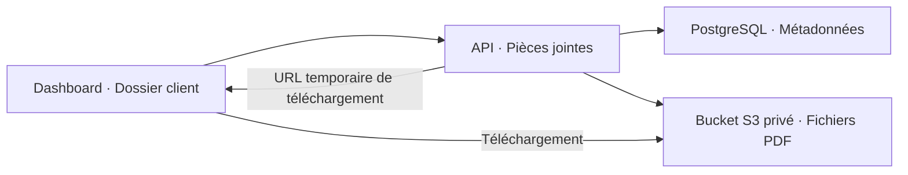

# Pièces jointes PDF — aperçu de la spec technique

Exemple fictif d’ajout de PDF à un dossier client. Les noms et chemins ci-dessous sont des propositions techniques, pas des éléments vérifiés dans un dépôt applicatif.

## Vue d’ensemble



**Choix proposé :** faire passer l’upload par l’API existante, qui contrôle l’accès et valide le fichier avant stockage.

## Ce qu’on ajoute ou modifie

| Élément | Solution technique |
|---|---|
| **Écran existant** | `/dashboard/clients/[clientId]` : ajouter une section « Pièces jointes ». |
| **Nouveau composant** | `frontend/dashboard/src/app/dashboard/clients/[clientId]/ClientAttachments.tsx` : sélection du PDF, liste et téléchargement. |
| **Nouveau fichier de routes** | `backend/api/src/routes/client-attachments.ts` : utilise la session et le contrôle d’accès au dossier existants. |
| **Nouvelle table** | `client_attachments` : conserve les métadonnées et le lien vers le dossier client. |
| **Nouveau bucket privé** | Nom logique proposé : `ClientAttachmentsBucket`, déclaré dans `backend/api/infra/storage.ts`. Contient les PDF. |

## Données enregistrées

Table `client_attachments` — champs obligatoires :

| Champ | Type | Rôle |
|---|---|---|
| `id` | `uuid` | Identifiant de la pièce jointe |
| `client_id` | `uuid` → `clients.id` | Dossier propriétaire |
| `display_name` | `text` | Nom original affiché |
| `size_bytes` | `integer` | Taille du fichier |
| `created_at` | `timestamptz` | Date d’ajout |

Chemin du PDF dans le bucket :

```text
organizations/{organizationId}/clients/{clientId}/attachments/{attachmentId}.pdf
```

## Connexion front → back

| Route | Fonction |
|---|---|
| `GET /clients/:clientId/attachments` | Retourne la liste des métadonnées |
| `POST /clients/:clientId/attachments` | Reçoit le PDF et son nom, retourne la pièce jointe créée |
| `GET /clients/:clientId/attachments/:attachmentId/download` | Retourne une URL S3 temporaire |

Le front réutilise **`apiFetch`**. Le backend réutilise **`@aws-sdk/client-s3`** et **`@aws-sdk/s3-request-presigner`**. Le test propose **`pdf-lib`** pour analyser le PDF : c’est une nouvelle dépendance à évaluer.

## Règles structurantes

- Contrôle de l’organisation sur chaque opération ; PDF de **10 Mio maximum**.
- Le fichier est enregistré dans S3, puis les métadonnées en base. Il apparaît dans la liste seulement après réussite des deux opérations.
- En cas d’échec d’insertion en base, tentative de nettoyage du fichier S3.
- Une erreur laisse le dossier utilisable et permet un nouvel essai manuel.
