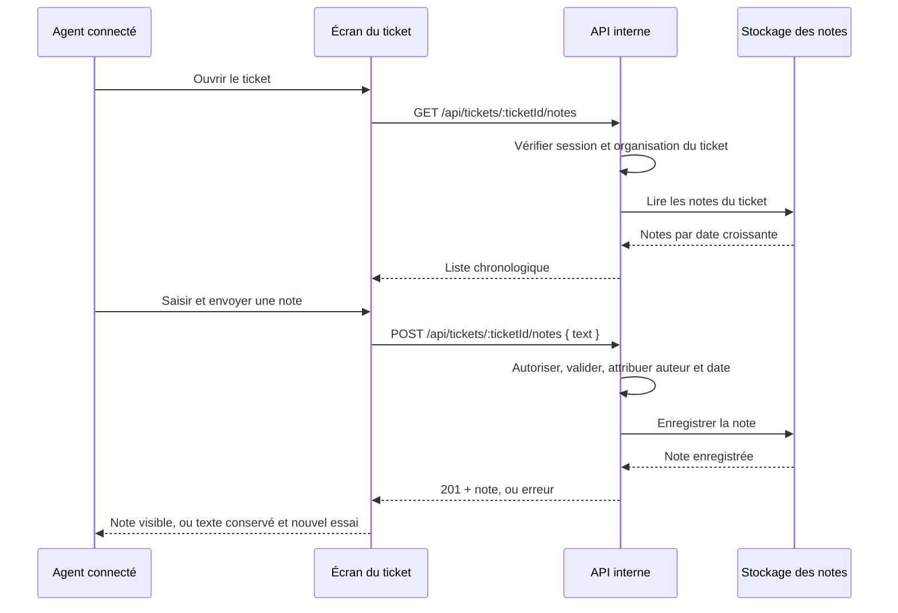

# Notes internes aux tickets

**Statut : brouillon — décision produit attendue.**

Les agents support doivent pouvoir consigner du texte interne sur les tickets de leur organisation. La solution recommandée ajoute une liste chronologique et un formulaire au détail du ticket, avec une API qui contrôle l’organisation et attribue l’auteur et la date côté serveur. La possibilité de modifier une note après sa création reste à décider.

Le produit est fictif : l’accès actuel aux tickets est décrit dans les notes de brainstorming, sans code vérifiable. Les chemins, routes et noms de données ci-dessous sont des **propositions techniques**, pas des éléments existants confirmés.

## Surfaces et contrats proposés

| Couche | Contrat |
| --- | --- |
| Écran modifié | Détail du ticket à `/tickets/:ticketId`, chemin proposé `frontend/tickets/TicketDetail.tsx`. Ajouter une section « Notes internes » avec texte brut, auteur et date. |
| Composant proposé | `frontend/tickets/TicketNotes.tsx` : liste, champ de saisie, bouton d’envoi et erreur avec action « Réessayer ». Aucun contrôle d’édition décidé à ce stade. |
| Lecture | `GET /api/tickets/:ticketId/notes` → `200 { notes: Note[] }`. Handler proposé : `backend/tickets/notes.ts`. Accès réservé aux agents connectés de l’organisation du ticket. |
| Création | `POST /api/tickets/:ticketId/notes`, corps `{ text: string }` → `201 { note: Note }`. Même handler et même contrôle d’accès. Aucun auteur ni horodatage fourni par le client n’est utilisé. |
| Réponse `Note` | `{ id: string, ticketId: string, text: string, authorId: string, createdAt: string }`, tous obligatoires ; `createdAt` est une date UTC ISO 8601. Présentation de l’auteur à raccorder au référentiel d’agents du produit. |
| Données proposées | Collection/table logique `ticket_notes` : champs de `Note`, date stockée comme horodatage, clé primaire `id`, relations vers le ticket et l’agent auteur. L’organisation est déterminée via le ticket. Lecture ordonnée par `createdAt`, puis `id` pour départager les dates identiques. |

Réutiliser le stockage, la session et le référentiel d’agents du produit ; aucune nouvelle bibliothèque ni infrastructure dédiée n’est nécessaire au niveau de ce design. Leur technologie et leur emplacement physique ne sont pas connus.

## Règles et échecs

- Le serveur vérifie l’accès au ticket pour chaque lecture et création, indépendamment des contrôles de l’écran.
- `text` doit être une chaîne, obligatoire après `trim`, de 2 000 caractères maximum. Proposition technique : enregistrer le texte trimé et compter ses points de code Unicode côté client et serveur.
- Le rendu affiche du texte brut, sans interpréter de HTML.
- Après succès, afficher la note enregistrée et vider le champ. Après erreur, conserver la saisie et proposer un nouvel essai manuel, sans réessai automatique.
- Réponses proposées : `400` pour texte invalide, `401` sans session, `404` pour ticket absent ou inaccessible, `500` pour échec serveur.
- Une réponse réseau perdue après enregistrement peut rendre le résultat incertain ; aucun mécanisme de déduplication n’est spécifié ici.
- Aucun e-mail, aucune notification et aucune suppression en V1.

## Vérifications observables

- Deux agents d’une même organisation peuvent créer puis lire les notes du même ticket, dans l’ordre chronologique ; une autre organisation ne peut ni les lire ni en créer.
- Un texte vide après trim ou dépassant la limite est refusé. Auteur et date correspondent à la session et au serveur.
- Un échec de création laisse le texte disponible et permet un nouvel essai manuel ; un succès affiche la note et efface la saisie.

## Décision produit ouverte

**Les notes doivent-elles être immuables dès l’envoi, ou modifiables par leur auteur pendant 15 minutes ?**

Aucune des deux possibilités n’est retenue implicitement. Le contrat d’édition, ses contrôles et ses vérifications restent à ajouter si la seconde option est choisie ; le statut reste « brouillon » jusqu’à cette décision.
