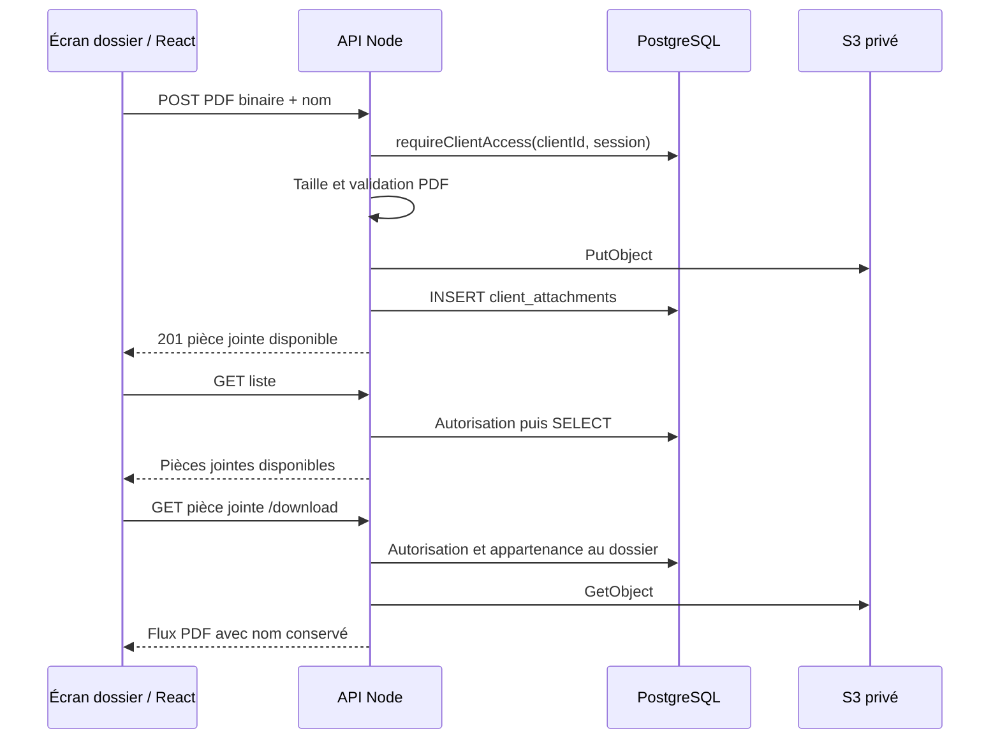

# Pièces jointes PDF des dossiers clients

**Prêt pour revue.** Les exigences produit sont validées. Les éléments dits existants proviennent exclusivement du contexte fictif fourni ; les ajouts et contrats ci-dessous sont des propositions techniques.

Un commercial doit pouvoir ajouter plusieurs PDF à un dossier, consulter leurs noms et les télécharger. Je recommande de faire transiter chaque fichier par l’API : sa limite en streaming existe déjà et permet de valider le contenu avant de créer un objet S3 privé, puis sa ligne PostgreSQL. Aucun protocole d’upload direct, état provisoire visible ou composant d’upload dédié n’est nécessaire.

## Structure proposée

| Couche | Emplacement et responsabilité |
| --- | --- |
| Écran existant modifié | `/dashboard/clients/[clientId]` ; `frontend/dashboard/src/app/dashboard/clients/[clientId]/page.tsx` intègre la section des pièces jointes. |
| Composant proposé | `frontend/dashboard/src/app/dashboard/clients/[clientId]/attachments.tsx` : champ natif `type="file"`, `accept="application/pdf,.pdf"`, liste des noms, ajout, téléchargement et reprise manuelle. Réutilise `apiFetch`. |
| Routes proposées | `backend/api/src/routes/client-attachments.ts` : les trois routes ci-dessous, validation, SQL via le `db` existant et appels S3. Chaque route exige une session et appelle `requireClientAccess`. |
| Stockage proposé | Nouveau bucket privé, nom logique `ClientAttachments`, dans `backend/api/infra/storage.ts` existant. Accès public bloqué ; rôle API limité à `PutObject`, `GetObject`, `DeleteObject` sur ce bucket. Pas d’accès S3 depuis le navigateur. |
| Dépendances | Réutiliser React, `apiFetch`, `db`, `@aws-sdk/client-s3` et `node:crypto.randomUUID`. Ajouter **`pdf-lib`**, proposé pour analyser la structure PDF sans OCR ni rendu ; le SDK S3 ne valide pas les fichiers. Le presigner installé reste inutile ici. |

## Contrats

Préfixe : `/clients/:clientId/attachments`. Identifiants UUID ; `clientId` est toujours vérifié contre l’organisation de la session.

| Route | Entrée et sortie |
| --- | --- |
| `POST /` | Corps binaire `application/pdf` ; `X-Attachment-Name` contient le nom encodé avec `encodeURIComponent`. Réponse `201` : `Attachment`. |
| `GET /` | Réponse `200` : `{ attachments: Attachment[] }`, tri stable par `createdAt`, puis `id`. |
| `GET /:attachmentId/download` | Vérifie aussi que la pièce jointe appartient à ce dossier. Réponse `200` : flux `application/pdf`, `Content-Disposition: attachment` avec `filename*` UTF-8, `Cache-Control: private, no-store`. |

`Attachment = { id: string, name: string, sizeBytes: number, createdAt: string }` ; date ISO 8601. Les erreurs JSON exposent `{ code: string, message: string }` : `400` métadonnées invalides, `413` taille dépassée, `415` contenu non PDF, `503` stockage indisponible ; les refus d’accès reprennent le contrat existant.

| Donnée proposée | Contrat |
| --- | --- |
| Migration | `backend/api/src/db/migrations/20261001_client_attachments.sql`, emplacement proposé à adapter à l’outil de migration retenu. |
| Table `client_attachments` | Tous obligatoires : `id uuid PRIMARY KEY`, `client_id uuid REFERENCES clients(id)`, `name text`, `size_bytes integer`, `object_key text UNIQUE`, `created_at timestamptz`. Index `(client_id, created_at, id)` pour la liste. L’organisation vient de `clients`, sans duplication. |
| Objet S3 | Clé `organizations/{organizationId}/clients/{clientId}/attachments/{attachmentId}.pdf`, construite par l’API. Contient uniquement les octets originaux ; le nom affiché et les métadonnées restent en SQL. |

## Règles et vérification

- Autoriser avant de lire le fichier. Borner le flux à **10 × 1 024 × 1 024 octets**, indépendamment de `Content-Length`. Le navigateur vérifie aussi la taille pour informer rapidement.
- Décoder et valider le nom, obligatoire, sans caractères de contrôle ; préserver accents et espaces. Ne jamais l’utiliser comme chemin ou clé.
- Accumuler au plus 10 Mio, contrôler la signature PDF puis analyser la structure avec `pdf-lib`. Conserver les octets originaux ; utiliser `ignoreEncryption: true` pour inspecter les PDF chiffrés sans exiger leur mot de passe. Cette validation ne constitue pas une analyse antivirus.
- Écrire S3 avant SQL. Si S3 échoue, aucune ligne ; si SQL échoue, supprimer l’objet en compensation. Une compensation échouée laisse un objet orphelin privé, journalisé, jamais listé. Après réponse perdue, recharger la liste avant de proposer un nouvel ajout ; aucune garantie de déduplication automatique.
- Vérifier : PDF valide de 10 Mio accepté, dépassement et faux PDF rejetés ; noms accentués conservés ; plusieurs fichiers listés et téléchargés à l’identique ; autre organisation refusée ; upload interrompu absent ; panne S3/SQL sans entrée visible ni blocage du dossier, avec essai manuel.
- Aucun plafond de nombre, suppression utilisateur, prévisualisation, partage public, OCR, recherche plein texte ou IA en V1.
